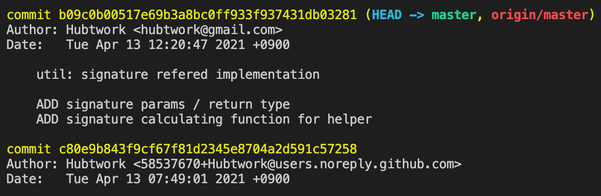

### Git Commit Message 수정하기

> ✔ **OS : macOS Big Sur 11.3**
>
> ✔ **Git version 2.24.3**
>
> ✔ **zsh 5.8**

#### Background

- 불가피한 에러 수정 등으로 인해 커밋 시점이 예상했던 시점보다 늦어졌거나 통합 회의 등 기한에 대해 민감할 경우 이를 수정해야 할 경우가 있음
- 일반적으로 커밋 메세지의 수정은 가능하지만 시점은 변경하지 못한다고 알고 있으나 원하는 커밋에 대해 시점을 변경할 수 있음

#### 1. Git Filtering

- `git log` 를 이용해 커밋 내역들을 확인하고 그 해시값으로 필터링을 해 변경을 할 수 있음

~~~shell
git filter-branch -f --env-filter \ 
'if [ "$GIT_COMMIT" = { Commit Hash Value } ] 
  	then
        export GIT_AUTHOR_DATE="{ Date to be changed }"
        export GIT_COMMITTER_DATE="{ Date to be changed }" 
fi'
~~~

- 다만 필터링 구문은 Indentation 및 Space 에 민감해 틀릴 경우 동작하지 않을 수 있으니 조심해야 함
- **주의 )** 필터링으로 변경된 커밋 및 그 이후의 커밋들은 모두 해시값이 변경되므로 다시 변경할 때 재확인을 해야하므로 시간이 오래 걸림

~~~shell
~/Desktop/Repository/NCPClient master
❯ git filter-branch -f --env-filter \ 
'if [ $GIT_COMMIT = b09c0b00517e69b3a8bc0ff933f937431db03281 ] 
    then
        export GIT_AUTHOR_DATE="Tue Apr 13 12:20:47 2021 +0900"
        export GIT_COMMITTER_DATE="Tue Apr 13 12:20:47 2021 +0900" 
fi'
~~~

#### 2. Git Rebase

- `git log` 를 이용해 커밋 내역들을 확인하고 변경을 원하는 커밋 직전의 커밋 해시값으로 `rebase interactive ( -i )` 을 수행

~~~shell
git rebase { Commit Hash Value } -i
~~~

- 아래 사진에서 필자가 수정을 원하는 것은 위 커밋이므로 아래 커밋해시값을 기준으로 `rebase` 를 열어줌

~~~shell
~/Desktop/Repository/NCPClient master
❯ git rebase c80e9b843f9cf67f81d2345e8704a2d591c57258 -i
~~~

- 원하는 커밋을 선택해 `edit` 상태로 변경 후 아래 명령어를 이용해 커밋 날짜를 수정

~~~shell
GIT_COMMITTER_DATE="{ Date to be changed }" git commit --amend --no-edit --date "{ Date to be changed }"
~~~

- 아래와 같이 원하는 날짜로 수정 후 `rebase 저장` , `push` 하면 원격 저장소에도 변경된 것을 확인할 수 있음

~~~shell
~/Desktop/Repository/NCPClient master
❯ GIT_COMMITTER_DATE="Thu Apr 14 12:20:47 2021 +0900" git commit --amend --no-edit --date "Thu Apr 14 12:20:47 2021 +0900"
...
~/Desktop/Repository/NCPClient master
❯ git rebase --continue
~/Desktop/Repository/NCPClient master
❯ git push origin master
~~~

### REFERENCE

- https://git-scm.com/docs/git-filter-branch
- https://git-scm.com/docs/git-rebase

