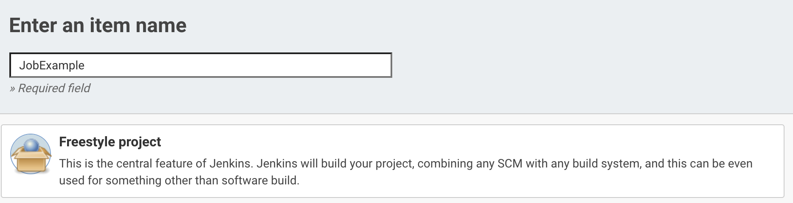
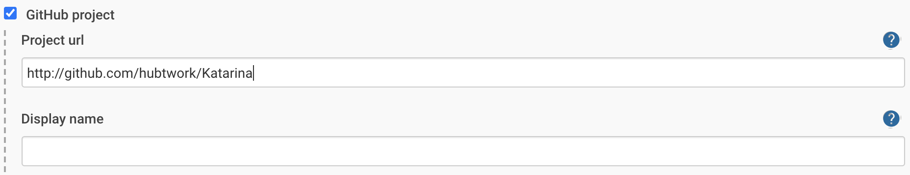
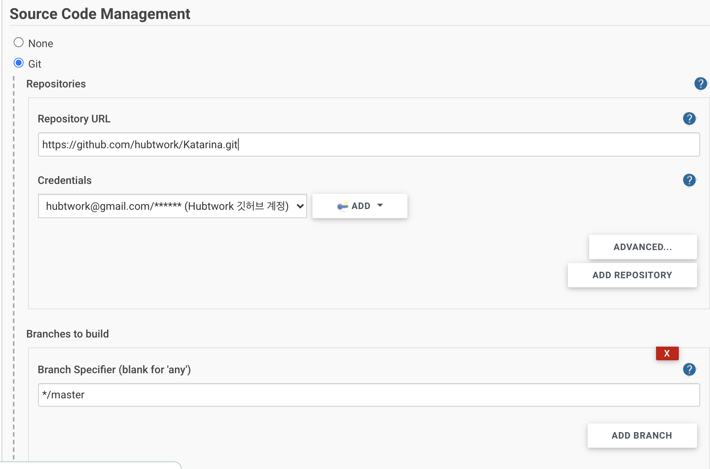
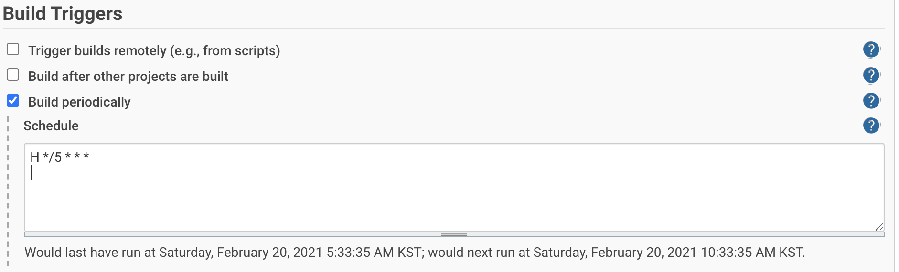
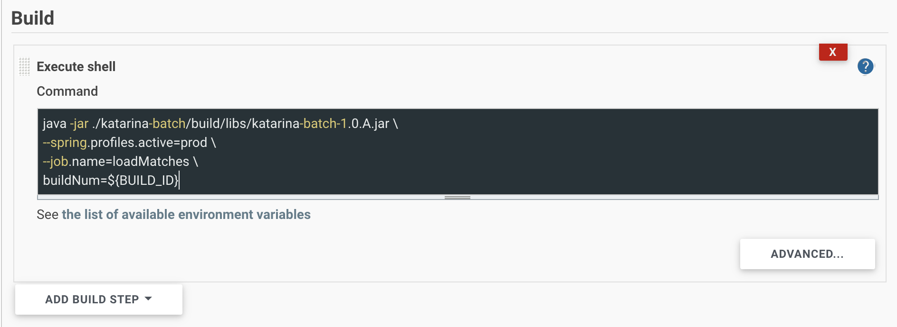
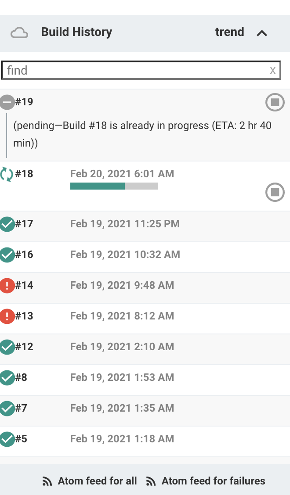

### Spring Batch Scheduling In Jenkins

> ✔ **OS : CentOS 7.3**
>
> ✔ **Jenkins : Jenkins 2.279**

#### Background

- Spring Batch Job 을 **스케쥴링** 할 수 있는 방법

  1. **Spring Cloud Data Flow** : Spring Batch Admin 에서 전환됨 **사용 경험 없음**

  2. **Quartz** : Admin 대시보드 작성 후 Quartz 를 스케쥴러로 사용 **생산성이 떨어짐**

  3. **Admin API** : Rest API 기반의 Admin Page 를 직접 작성, 스케쥴러로 사용 **High Cost**

  4. **Cron** : Unix 잡 스케쥴러 **스크립트 기반 잡 스케쥴링 쉬움**

  5. **CI 서비스** ( Jenkins, TeamCity 등 ) : 배포되는 Jar 의 빌드 타임을 스케쥴링해 사용 **배치 App 배포와 스케쥴링을 동시에 가능**

- Quartz 나 Admin API 방식의 경우 **직접 작성** 해야하기 때문에 생산성이 떨어지며 CI 서비스나 SCDF 와 같은 성능을 내기 힘들다.
- Spring Cloud Data Flow 는 사용해보지 않음, 기회가 되면 시도해 볼 예정
- CI 서비스인 Jenkins 를 이용, Github 의 브랜치로부터 배치 어플리케이션을 주기적으로 빌드, 실행하는 방법을 설명

#### Jenkins ?

- Jenkins 는 기본적으로 배포를 목적으로하는 Java 의 대표적 CI 툴
- 일반적인 구성 ( Jenkins 배포 서버 + Jenkins 스케쥴링 서버 )
  - Jenkins 배포 서버 : Github 으로부터 프로젝트를 Pull , Test / Build 수행 후 배포
  - Jenkins 스케쥴링 서버 : Batch Applicaiton Jar 실행 스케쥴링

> 본 글은 Github 에서 프로젝트를 가져와 스케쥴링해 빌드 / 실행 하는 방법을 설명

#### Jenkins 에 Job 생성

- **New Item > Free Style Project** 진행

- **Github Project** 설정
  - 해당하는 Github 프로젝트 주소 기입

- **Source Code Management**
  - 해당 Git Repository 기입 
  - Credentials ADD 를 통해 본인의 깃허브 아이디 / 비밀번호를 이용한 인증정보 생성

- **Build Triggers** 설정
  - Cron 을 사용해 빌드가 주기적으로 일어나게끔 지정
  - Jenkins 에서는 해당 크론 명령어를 해석해 아래에 빌드 예정시점을 설명해주니 참고하여 작성

- Build 후 **Execute Shell** 설정
  - Build 탭의 ADD Build Step > Execute Shell
  - 빌드된 jar 파일을 실행할 shell script 작성

- **Project > Build Now** 실행

#### Build History

- 아래와 같이 Build History 에 지정한 Cron 에 따라 자동으로 Batch Job 이 스케쥴링됨
- 만약 지정 스케쥴에 빌드를 시도하는데 이전 빌드가 아직 진행중이라면, 해당 빌드는 Build Queue 에서 대기

