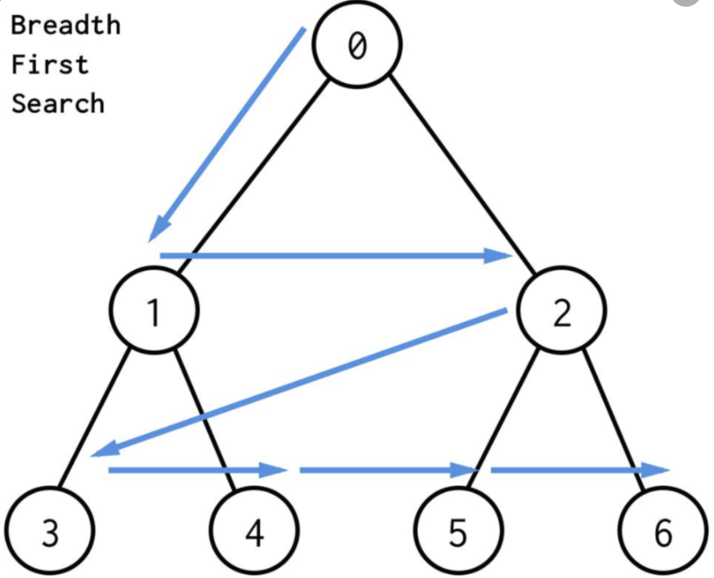

### BFS ( 너비 우선 탐색 )

#### BFS ?

- `BFS ( Breadth-First Search )`  - 너비 우선 탐색. 특정 노드부터 시작해 거리에 기반해 인접 노드부터 먼저 탐색하는 방법

- **특징**

  - 시작 노드의 가장 가까운 노드부터 가장 먼 노드 순으로 모든 노드를 탐색
  - 노드의 수가 적고, 깊이가 얕을 경우 **속도가 빠름**
  - **길찾기** - 거리순으로 노드를 탐색하므로 `최단경로` 가 존재한다면 반드시 찾을 수 있음
  - **비효율** - 큐를 이용해 방문할 노드, 부가 정보 등을 저장해야 하므로 노드가 많아질수록 `메모리` 를 많이 사용하게 됨

- **원리**

  - 시작 노드를 탐색. 인접 노드를 `Queue` 에 삽입
  - *Loop ( until `Queue` is Empty )* 
    - `Queue` 에서 노드를 꺼내 탐색
    - 방문하지 않은 인접노드를 `Queue` 에 삽입

  > **방문한지 여부를 어떻게 ?**
  >
  > - **일반** - `visited` 형태의 지표를 이용 ( 주어진 그래프, 지도 배열 등을 복사해 방문을 확인할 수 있도록 사용 )
  > - **길찾기** -  `passed` 배열을 이용 ( 현재까지 지나온 노드, 위치 등을 기록하며 함께 `Queue` 에 삽입 )

 

#### BFS Basic Implementation

- `Python` 의 경우 배열을 이용해 `Queue` 를 구현할 경우 비효율적이기 때문에 `deque` 를 사용해 구현함

~~~python
from collections import deque, defaultdict

# graph is implemented using defaultdict
def BFS(start, graph, visited):
    traverse = []
    # visit start and add to traverse-List
    q = deque([start])
    visited[start] = True
    traverse.append(start)
    while q:
        node = q.popleft()
        # check all close nodes
        for nxt in graph[node]:
            # if not visited, plan to visit and add to traverse-List
            if not visited[nxt]:
                visited[nxt] = True
                traverse.append(nxt)
    return traverse
~~~

