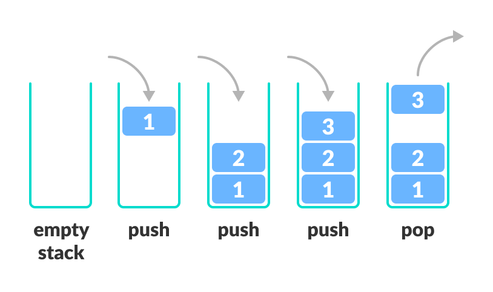

### Data Structure - Stack

#### Stack

- `Stack` - **LIFO ( Last In First Out )** 형태의 선형 ( Linear ) 자료구조

- **LIFO** - 마지막에 들어온 데이터가 가장 먼저 나가는 형태로서 **후입선출** 이라고도 함

  - 예시로 **텍스트 에디터** 의 `history management` 를 들 수 있다
  - 작성한 내용의 변화 등은 **LIFO** 형태로 저장되어 사용자가 `undo` / `redo` 의 기능을 수행할 수 있도록 한다

- **Stack Operation**

  - `push` - 스택에 데이터 삽입
  - `pop` - 스택의 마지막 데이터 삭제
  - `peek` - 스택의 마지막 데이터 반환
  - `isEmpty` - 스택이 비었는지 여부를 반환
  - `size` - 스택의 크기 반환

  

 

- **Stack Implementation**

  - **배열을 이용한 구현**

  > 구현이 간편하며 **python** 과 같이 동적 배열을 지원하는 언어의 경우 크기에 제한을 받지 않아 제약사항이 없음

  ~~~python
  class Stack:
      def __init__(self):
          self.stack = []
          self.error = "Error - Stack is Empty"
      
      def push(self, data):
          self.stack.append(data)
      
      def pop(self):
          if self.isEmpty():
              return self.error
          return self.stack.pop()
    
      def peek(self):
          if self.isEmpty():
              return self.error
          return self.stack[-1]
    
      def isEmpty(self):
          return True if len(self.stack) == 0 else False
    
      def size(self):
          return len(self.stack)
  
      # Object To String Override
      def __str__(self):
          return ' < '.join(map(str, self.stack))
  ~~~

  - **연결리스트를 이용한 구현**

  > 스택의 경우 <u>동적배열을 지원하지 않는 언어</u> 의 경우 배열을 이용한 구현 시 `peek` 포인터 인덱스를 이용해 구현해야하기 때문에 **언어 의존적**
  >
  > 동적 배열을 지원하지 않는 언어의 경우 **크기 제한** 이 문제사항이 될 수 있으며 노드 개수만큼 메모리를 사용하기 때문에 **메모리 효율성** 에 유리함
  >
  > **구현**
  >
  > - 노드 포인터가 항상 `peek` 를 가리킴
  > - `push` 할 때 기존 `peek` 가 `next` 포인터로, 새 노드가 `peek` 로 교체
  > - `pop` 할 때 `peek` 노드를 추출하고 다음 노드를 새로운 `peek` 로 교체

  ~~~python
  class NodeStack:
      def __init__(self):
          self.stack = None
          self.error = "Error - Stack is Empty"
  
      def isEmpty(self):
          return True if self.stack == None else False
      # fetch peek data
      def peek(self):
          if self.isEmpty():
              return self.error
          return self.stack.data
  
      def push(self, data):
          node = Node(data)
          node.next = self.stack
          self.stack = node
  
      def pop(self):
          if self.isEmpty():
              return self.error
          data = self.stack.data
          self.stack = self.stack.next
          return data
  
      def __str__(self):
          if self.isEmpty():
              return self.error
          # fetch all data in stack
          s = []
          node = self.stack
          while node != None:
              s.append(node.data)
              node = node.next
          return ' < '.join(map(str, s[::-1]))
  ~~~

