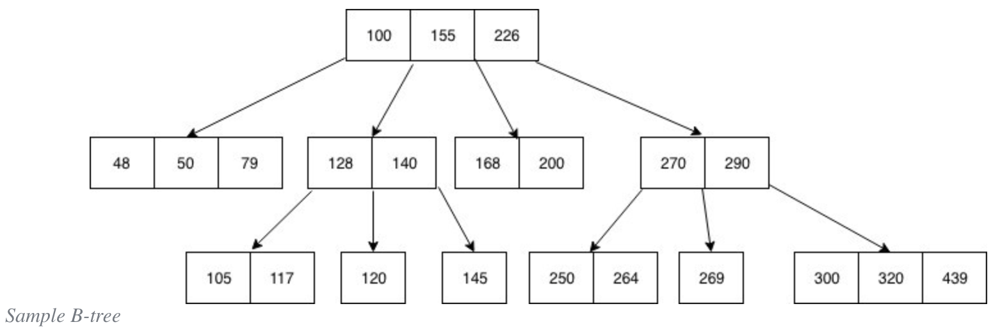
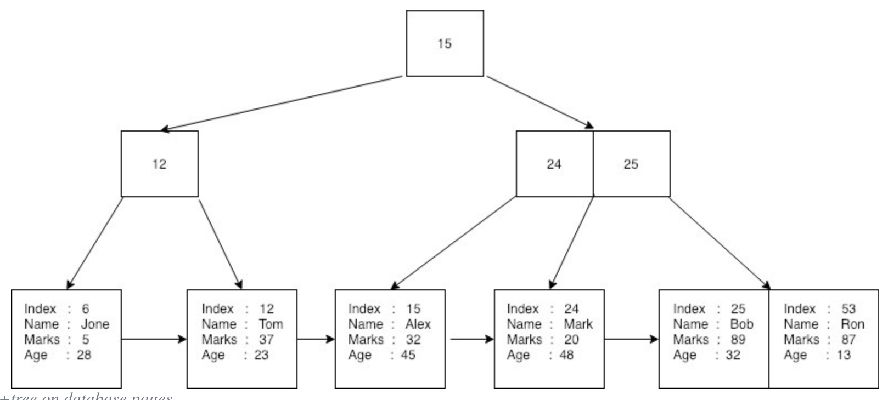

### DB Index Fundamentals

#### DataStructure for Index ?

- **Index** - DB 내에 데이터의 저장 외에 `별도의 저장공간` 을 마련해 테이블 내의 데이터 **검색속도를 향상** 시키기 위한 `자료구조`
- **Index** 개념의 구현은 다양한 `자료구조` 로 가능하다 ( 배열, 해시테이블 등 )
- **But** 해당 자료구조는 **Index** 에 적용할 때, 아래와 같은 특징과 단점이 존재한다
  - `배열` - 인덱스가 **Ordered** 하게 관리된다는 가정하에 탐색에서 매우 높은 성능을 보이지만 삽입 / 수정 / 삭제에서 매우 불리함
    - 데이터 탐색 - 순차적으로 데이터가 정렬되어있기 때문에 범위연산에서도 뛰어난 성능을 보임 `O(log N)`
    - 데이터 삽입 - 삽입할 데이터 위치 탐색  `O(log N)` + 데이터 삽입 후 뒤의 데이터를 밀어내는 과정 `O(N)` = `O(N * log N)`
    - 데이터 수정 - 데이터 수정 후 정렬에 따른 재배치 `O(N*log N)` 
    - 데이터 삭제 - 삭제할 데이터 탐색 `O(log N)` + 데이터 삭제 후 뒤의 데이터를 당겨오는 과정 `O(N)` = `O(N * log N)`
  - `해시 테이블` - 모든 알고리즘 중 탐색에서 가장 높은 성능을 보이지만 **다수의 데이터 검색 시 성능 저하**
    - 단일 데이터 탐색 - 해시함수에 의한 탐색 `O(1)`
    - 범위 데이터 탐색 - 주어진 범위에 해당하는 값이 특정되지 않으므로 해시테이블을 전부 확인해봐야할 수도 있음 `O(∞)`
    - 부분 데이터 탐색 - 부분 문자열 ( LIKE 연산 ) 과 같은 탐색을 진행하고자 할 때 해시테이블을 전부 확인해봐야함 `O(∞)`

- 이에 **DB** 는 일반적으로 `B-Tree` , `B+Tree` 자료구조를 이용해 구현됨

#### B-Tree

- 대표적인 `Balanced Tree` 로 탐색에 있어 Worst case 조차 `O(log N)` 의 시간복잡도를 갖는 **탐색 성능 특화** 자료구조

- **M 차 B-Tree** 란 한 개의 노드에 M 개의 데이터가 저장되는 `B-Tree` 를 말함

  > **Balanced Tree ?**
  >
  >  `트리` 자료구조는 평균적으로 `O(log N)` 의 탐색시간을 갖는 자료구조이다. 하지만 특성에 따라 한 방향으로 편중된 구조를 갖게 될 수 있으며 이 때, 탐색시간은 `O(N)` 을 띄게 되는데 이는 원하는 데이터를 찾기 위해 모든 노드를 거쳐야할 수도 있다는 것이다. 이러한 최악의 경우를 막기 위해 `Balanced Tree` 는 삽입 / 삭제 연산을 진행시에 일정한 규칙에 따라 전체 노드의 자식 수의 평형을 유지한다. 
  >
  >  즉 `Balanced Tree` 란 데이터의 삽입 / 삭제 시에 규칙에 따른 추가연산이 수반되어 *낮은 성능* 을 띄게 되지만 탐색시에는 항상 `O(log N)` 을 보장한다. 대표적으로 `AVL Tree` , `2-3 / 2-3-4 Tree` , `Red-Black Tree` , `B-Tree` , `B+ Tree` 등이 있다.

- **`B-Tree` 의 구조**
  - `Root` , `Branch` , `Leaf` 총 3가지 노드로 이루어짐
  - 각 노드는 **정렬상태** 이며 여러 개의 데이터를 가짐 ( *일반 트리랑 다른 점* )
  - 자식 노드는 노드 내의 데이터간 범위에 따라 삽입됨
  - 즉, 노드의 데이터 수가 N 개라고 가정했을 때 자식 노드는 N+1 개를 가짐
  - **Full-Scan** 시에는 모든 노드를 탐색해야하므로 성능 저하
- **`B-Tree` 의 규칙**
  - **Root 노드** 는 2개 이상의 데이터를 가져야 함
  - `M차 B-Tree` 에 대해 **Root 노드** 외의 노드는 최소 M/2 개 이상의 데이터를 가져야 함
  - 노드 내의 데이터는 항상 **Ordered, Unique**
  - 노드 내의 데이터들에 대해서 각 데이터의 `left Node` 는 더 작은 값, `Right Node` 는 더 큰 값이 위치함
  - 모든 리프 노드까지의 거리는 항상 동일함

- **DB** 는 대량의 데이터를 보관하며 데이터를 탐색할 때의 성능이 매우 중요하기 때문에 `B-Tree` 를 채택함
  - `B-Tree` 는 다른 `Balanced Tree` 들과는 달리 하나의 노드에 **M개의 데이터** 를 가지기 때문에 데이터를 찾기 위한 *참조포인터* 의 개수가 적어 메모리 접근 속도가 빠름
  - 모든 데이터가 정렬되어 있으며 중복 값이 없으므로 **Key + Data Pointer** 의 관리가 용이하고 *부등호 연산* 등에 유리함
  - 탐색을 위해 자주 Access 되는 노드를 **루트 노드에 가까이 두어** 탐색 속도를 높일 수 있음

 

#### B+Tree

- `B-Tree` 를 메모리 효율성과 검색 효율성을 개선한 자료구조

- `B+Tree` 로 구현된 인덱스의 경우 `Leaf Node = Column Data + RID(Record Identifier)` 로 이루어져 있으며 실제 값과 해당 레코드에 대한 포인터를 의미함

- **`B+Tree` 주요 개선점**

  - **Tree 의 높이 단축** - 모든 노드가 데이터를 갖던 `B-Tree` 와 다르게 `Index Node = Key` , `Leaf Node = Index + Data` 의 구조로 변경하여 하나의 노드가 더 많은 Key 를 가질 수 있게 함 

  - **중복 Key 의 표현** - 모든 데이터가 Unique 인 `B-Tree` 와 다르게 리프노드만이 데이터를 가지고 있으므로 Key 의 중복을 허용함

  - **Linked List 추가** - 리프 노드간에 연결리스트를 추가함으로서 데이터 간의 선형탐색을 지원함 ( `B-Tree` 보다 **Full-Scan** 성능 향상 및 값에 대한 **범위 연산** 성능 향상, **순차탐색** 의 지원 등 )

    > **InnoDB** 의 경우 인덱스 노드간에도 연결리스트를 적용함으로서 Key 값 간의 <u>페이징</u>을 구현함

 

### REFERENCE

- https://dzone.com/articles/database-btree-indexing-in-sqlite
- https://en.wikipedia.org/wiki/B-tree
- https://en.wikipedia.org/wiki/Database_index
- https://stackoverflow.com/questions/1108/how-does-database-indexing-work