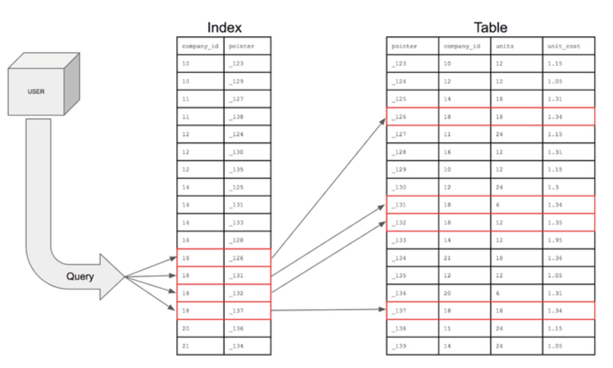

### What Is DataBase Index ? 

#### Index 란 무엇인가 ?

- **Index** - DB 내에 데이터의 저장 외에 `별도의 저장공간` 을 마련해 테이블 내의 데이터 **검색속도를 향상** 시키기 위한 `자료구조`

- **색인** - 우리가 책에서 필요한 자료를 빠르게 찾기 위해 색인을 활용하듯이 DB 에는 **Index** 라는 `데이터 색인` 이 존재함

- **Key + Row ID** - **Key** ( 지정한 `Column` 의 값 ) 과 **Row ID** ( 해당 `Column 값의 데이터` 가 저장된 `블록 위치` )

- `Index` 는 주로 검색되는 `Column` 에 대해 *데이터 와 그 블록의 위치* 를 가진 별도의 자료구조이며 **데이터 조회** 시에 해당 테이블을 먼저 참조해 필요한 데이터만 찾을 수 있게 함으로서 데이터 검색 효율을 증진시킨다

  > **알아두기**
  >
  > - 단순히 **조회** 에서만 인덱스가 그 성능을 발휘하는 것이 아니다
  > - **수정** , **삭제** 명령의 진행에도 해당 데이터에 대한 **조회** 가 선행되기 때문에 전반적인 성능 향상을 꾀할 수 있다
  > - **Index** 가 없다면 **삽입** 을 제외한 모든 연산은 테이블에 대해 항상 `Full Scan` 후 조건절에 의해 필터링하기 때문에 성능이 저하된다

 

#### DB 의 Index 관리

- `Index` 를 관리자가 원하는 `Column` 에 대해 설정하면 아래 연산들이 수행될 때 추가동작을 수행한다
  - **Insert** - 추가할 데이터에 대해 `설정된 칼럼` 들에 대해 인덱스를 생성
  - **Update** - 변경 이전의 데이터에 대한 인덱스를 `미사용` 상태로 변환하고 변경된 데이터에 대한 `새로운 인덱스` 생성
    - **DBMS** 의 입장에서 보았을 때 Index 가 걸려있는 데이터 갱신의 경우 `Delete - Insert` 두 가지 추가작업을 수행하는 것과 같음
    - 인덱스가 많을 수록 갱신 연산에서는 엄청난 부하가 발생할 수 있음
  - **Delete** - 삭제하는 데이터에 대한 인덱스를 `미사용` 상태로 변환 
    - 테이블의 데이터 수와 인덱스의 데이터 수의 차이가 발생

- 위와 같이 DBMS 가 `Index` 를 활용하기 위해서는 `Select` 를 제외한 나머지 연산을 수행시 추가적인 작업을 수행해야 한다
- 또한 `Index` 의 상태와 데이터의 상태가 일치하지 않으면 안되므로 DBMS 는 이를 관리하기 위한 **오버헤드** 가 발생한다
- 이 때문에 불필요한 `Index` 가 많아질 수록 DBMS 가 연산을 처리하기 위한 비용은 증가하게 되며 이에 따라 **성능 저하** 가 수반된다

#### Index 의 장 / 단점

- **Index 의 장점**

  - 테이블 내에서 데이터의 `조회 성능` 을 비약적으로 향상시킴 ( *색인으로서의 역할* )
  - `Index` 를 사용함으로서 DBMS 의 각 연산에서 발생하는 `시스템의 부하` 를 줄여 시스템의 성능을 향상시킴

  > **DBMS** 가 기본적으로 `Primary Key` 에 대해 `Index` 를 생성해주므로 우리는 기본적으로 최적화된 테이블을 사용한다 !

- **Index 의 단점** 

  - `Index` 를 관리하기 위한 추가동작의 수행으로 각 연산에 지연이 발생할 수 있음
  - `Index` 를 생성하기 위한 추가적인 메모리 공간이 요구됨 ( Index 또한 별도의 테이블임 )
  - `Index` 가 많아질수록, 연산이 많이 수행될 수록 `Index` 에 의한 성능 저하가 발생

- **총평**

  - `Index` 그 자체는 관리할 데이터의 수가 증가할수록 더 높은 **성능 향상** 을 꾀할 수 있다
  - 잘 설계되지 않은 `Index` 는 되려 DB 의 성능을 저하시킬 수 있으므로 반드시 **신중히 설계** 해야 한다
  - 데이터의 수정 / 삭제가 빈번하게 이뤄지는 경우 `Index` 의 사용을 피해야 한다
  - 데이터의 조회가 빈번하게 이뤄지는 경우 `Index` 의 적절한 설계를 통해 성능향상을 꾀해야 한다

### REFERENCE

- https://chartio.com/learn/databases/how-does-indexing-work/
- https://stackoverflow.com/questions/29842622/why-and-where-to-use-indexes-pros-and-cons/29842998
- https://vanseodesign.com/web-design/mysql-indexes/