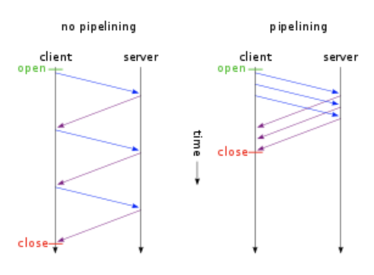
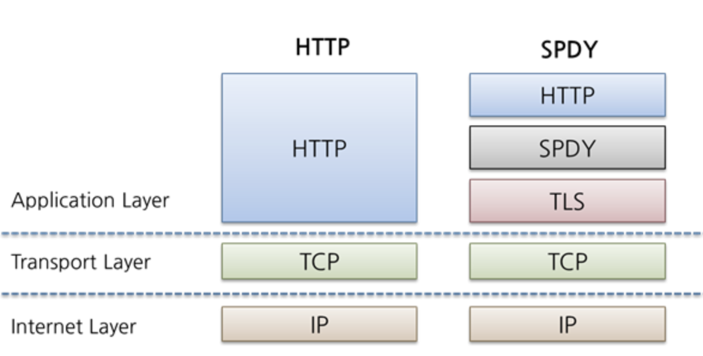
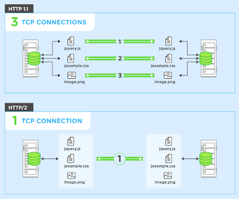

### HTTP 버전별 알아보기

#### HTTP/0.9

- HTTP 의 가장 초기 버전이며 버전 정보에 대한 의미 X ( 차후 버전과 비교를 위해 0.9 라 칭함 )
- **HTTP Get 통신** 만 가능하며 **HTTP Header 개념** 이 아직 없기 때문에 **HTML 파일만**을 전송 가능

- **HTTP Status Code 개념** 이 아직 없기 때문에 어떤 문제가 존재하는지에 대한 것을 파일 내부에 기술해 함께 전송

#### HTTP/1.0

- **TCP Connection** 당 하나의 URL 만 Fetch 하기에 **Request/Response** 를 하나의 연결로 보기 때문에 매번 재연결이 필요함
  - 요청시 마다 TCP 의 3-way HandShaking 이 발생함
  - **Keep-Alive ( Persistent-Connection )** - 추후에 Connection 헤더에 keep-alive 를 명시해 동일한 Endpoint 끼리의 연결에서 일어나는  open-close 의 간헐적 발생을 줄이는 방안이 마련되었음
- 각 연결에 대한 **open/close flow 제한** 으로 Congestion 발생에 의한 **Disconnect** 가 자주 발생, 서버의 성능 저하 유발
- **HTTP Header , HTTP Status Code **가 추가되면서 프로토콜의 확장이 가능해짐
- HTML 파일 외의 데이터 전송 가능, 사용자 및 상태 / 에러 식별 등 프로토콜의 다양한 확장이 가능해짐

~~~http
GET ../response.json HTTP/1.0
User-Agent: Mozilla/5.0 (Macintosh; Intel Mac OS X 11_1_0) AppleWebKit/537.36 (KHTML, like Gecko) Chrome/88.0.4324.150 Safari/537.36
Auth: privateUser
Connection: Keep-Alive
...
~~~

~~~http
STATUS 200 OK
Date: Sun, 21 Feb 2021 09:13:04 GMT
Expire: Sun, 21 Feb 2021 09:14:02 GMT
Last-Modified: Sun, 21 Feb 2021 01:30:23 GMT
Content-Encoding: gzip
Content-Type: application/json;charset=utf-8
...
~~~

- **HTTP 통신 확장** - Post / Head 지원

#### HTTP/1.1

- **HTTP 의 첫 표준 **
- 통신 간에 **Cache** 를 도입해 인터넷 프로토콜의 수행 속도 향상
  - **HTTP1.0** 에서는 Last-Modified , Date 등에 의존해 Cache 를 처리함
  - **HTTP1.1** 에서는 Cache 의 적합성 판단 및 미디어 타입 등도 지원함
- 1 Request 1 Response 을 개선해 **multiple request** 지원
  - **HTTP1.0** 과 달리 기본적으로 **Persistent-Connection** 지원. Connection 헤더는 필요에 의해 단일연결만 수행해야할 경우만 사용

 

- 기존의 1 Requst 1 Connection 구조를 개선해 **pipelining** 지원
  - Request 에 대한 Response 를 기다리는 것 대신에, 여러개의 Request 를 **하나의 TCP/IP 패킷에 연속적으로 Packing** 해 전송
  - 하나의 Connection 으로 여러개의 Request/Response 쌍을 처리하기 때문에 **Network Latency 를 효과적으로 줄임**

- **HTTP 통신 확장** - Put / Delete / Trace / Options 지원
- **HTTP 헤더 확장** - 다양한 헤더가 추가되었으며 **Request~Response** 까지의 시간을 표기하는 Age 가 추가됨

#### HTTP/1.1 의 단점

- 여전히 하나의 Request 에 대한 Response 처리 → **다수의 리소스 처리 및 데이터 전송 **등에서 성능 저하 이슈 발생
- 요청별 TCP 3-way HandShaking 이 일어남 → **RTT(Round Trip Time) 증가, 네트워크 지연**
- **Head Of Line Blocking** - Piepelining 을 통해 여러 리소스를 요청할 때 특정 리소스의 처리 지연이 발생하면 다음 리소스들은 계속 대기 상태
- **Cookie 에 의한 Heavy Header** - 1 Request 1 Header 구조 및 Cookie 정보 또한 중복 전송되기 때문에 요청 값보다 헤더가 큰 경우가 발생

#### HTTP/1.1 의 단점 극복 노력( 개발자, 설계자들이 활용하는 트릭 )

- **Domain Sharding** - 다수의 리소스를 여러개의 도메인으로 나누어 Parallel 하게 처리할 수 있도록 함
  - Domain 당 Connection 제한 개수가 존재하며 **DNS LookUp** 이 각 도메인에 대해 이루어지므로 성능저하 발생 
- **SPDY** - 구글에서 HTTP 프로토콜의 전송을 재정의한 고속 프로토콜
  - 제한 없는 동시 요청이 가능하며 Overhead 문제로 Domain Sharding 을 사용하지 않는 것을 추천

- **Image Spriting** - 다수의 이미지 요청 대신 웹페이지에서 사용되는 이미지들을 모아 하나의 이미지 파일로 만들고 CSS 에서는 좌표값을 이용해 사용하도록 함
- **CSS/JS Compress** - CSS / JS 파일의 용량을 줄여 HTTP 통신 데이터의 크기를 축소시킴
- **Data URI Scheme** - HTML 내 이미지들을 Base64 Encoding 데이터로 직접 입력하고 이를 가져오는 요청 수를 줄임

#### HTTP/2.0

- 앞서 기술한 구글의 **SPDY** 프로토콜에 기초한 고속 프로토콜
- **Header Compression** - 헤더를 HPACK 압축 및 이전 연결에 대한 헤더 목록을 유지/관리
- **Multiplexing** - 여러 데이터 요청을 병렬로 처리함으로서 연결의 개수를 효과적으로 줄임
  - HOL Blocking 의 원천적 해결 및 Domain Sharding 의 필요성을 제거

- **Server Push** - 서버에서 클라이언트가 요청한 리소스 내에서 필요로하는 리소스들을 캐싱해두고 알아서 보내주는 **Push Promise** 를 도입
  - 예를 들어 **HTTP 1.1** 의 경우 HTML 페이지를 받은 후 그 안에 필요한 리소스들을 다시 요청하여 가져오는 과정이 일어남
  - **HTTP 2.0** 은 HTML 페이지를 요청시 페이지 내에 포함된 리소스들을 **Push Promise** 를 통해 알아서 보내주고 불필요한 요청을 줄임

- **Stream Prioritization** - 리소스간 의존 관계를 설정해 리소스 요청 지연에 의한 브라우저 렌더링 지연을 해결
- **높은 브라우저 호환성** 

#### REFERENCE

- https://d2.naver.com/helloworld/140351
- https://kinsta.com/learn/what-is-http2