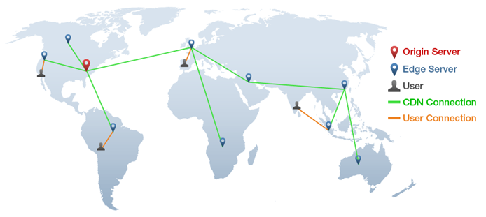

### What Is CDN ? 

#### CDN 이란 무엇인가

- **Contents Delivery Network** - 컨텐츠의 효율적인 전달을 위해 여러 노드를 가진 네트워크에 데이터를 저장, 제공하는 것을 의미함
- **목적** 
  - 물리적인 거리가 멀어질수록 네트워킹 비용도 증가하는데, CDN 을 통해 이를 해소
  - 전세계의 사용자들에게 용량이 큰 웹 컨텐츠들을 신속하고 빠르게 제공할 수 있는 **네트워크 인프라** 마련
  - 텍스트, 이미지, 영상 등의 미디어 컨텐츠부터 근래에는 라이브 스트리밍 미디어, 소셜미디어 컨텐츠, 소프트웨어까지 확장된 **컨텐츠 인프라** 구축

- **구성**
  - 전 세계에 배포된 **Edge Server ( Cache )** 를 통해 각 서버들을 상호 연결한 네트워크망을 구축하고 사용자들에게 신속하게 컨텐츠를 전달
  - <u>취급하는 컨텐츠</u> 에 따라 **Video Contents** 네트워크와 **Standard ( Non-Video )** 네트워크로 분류되며 컨텐츠 영역이 비디오로 확장됨에 따라 `Video CDN` 시장이 우세
  - <u>연계하는 솔루션</u> 에 따라 **Web Cache** 네트워크, **Media Transfer** 네트워크, **Cloud Security** 네트워크로 분류되며 SNS , 리치미디어 시장의 성장에 따라 `Media Transfer CDN` 시장이 우세하며 클라우드가 시장의 가파른 성장에 따라 `Cloud Network CDN` 이 가파르게 성장 중
  - <u>이용되는 산업</u> 에 따라 **Media** 네트워크, **Game** 네트워크, **Fintech** 네트워크, **Insurance** 네트워크, **Education** 네트워크 등으로 분류할 수 있는데, 산업 면에서는 전반적인 규모 확장 및 미디어 사용의 급증에 따른 가파른 성장세를 보이고 있음
- **장점**
  - `ISP` 에 직접적으로 연결해 데이터를 전송함으로서 컨텐츠 병목 현상을 줄여 **신속한 데이터의 전달** 이 가능함
  - 안정적인 로드 상태를 유지해 온라인 트랜잭션 등에서 **신뢰성과 응답성이 향상** 시킴으로서 고수준의 서버 운영을 도움
  - 클라우드 가속화기술의 도입과 함께 원활한 **로드 밸런싱** 을 통해 네트워킹 상에서 물리적 거리 제한을 초월한 성능 제어를 지원
  - 컨텐츠 로드 등 고용량의 데이터 전송등을 지원함으로서 불필요한 서버의 업무를 줄여 서버가 본래의 **비즈니스 로직** 에 집중하여 작업할 수 있게 함

 

### REFERENCE

- https://blog.webnames.ca/advantages-and-disadvantages-of-a-content-delivery-network/
- https://gtmetrix.com/blog/a-basic-guide-to-cdns-and-gtmetrix/