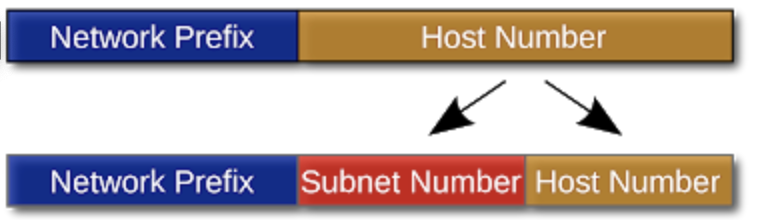
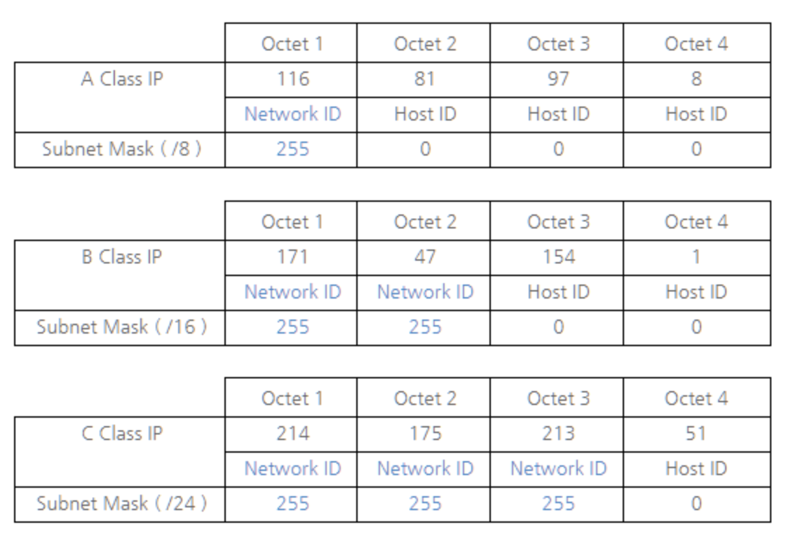
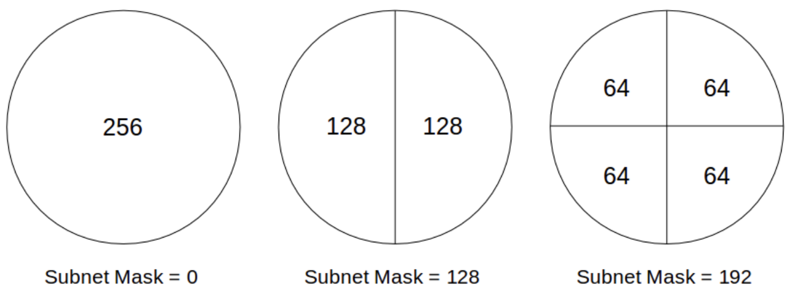

### What Is NetMask & SubnetMask ? 

#### NetMask 란 무엇인가

- **NetMask** - `네트워크 라우터` 와 함께 데이터 수신시 동일한 서브넷 내의 시스템에 데이터의 위치를 결정하는 데 사용하는 **숫자 코드**

- **IP주소** 의 `네트워크 주소` 표현부와 `기계 주소` 표현부를 식별하는 데에 사용됨

  > 네트워크 주소 부분의 비트를 1로 치환해 표현함으로서 <u>IP주소</u> 와 **AND** 연산을 통해 네트워크 주소를 구할 수 있음

- **목적**

  - 네트워크 상의 사용가능한 `호스트` 를 지정하고 통신 시 `라우터` 의 데이터의 목적지를 지정
  - **IP 주소** 를 `서브넷` 으로 분할하거나 `슈퍼넷` 으로 병합

- `라우터` 가 IP 주소의 넷 마스크를 계산해 **Class A ~ C** 의 넷마스크를 생성 

  - 네트워크의 표현 범위에 따라 Class 가 다름
  - **Class A **- `255.0.0.0` , 8bit 네트워크 + 24bit 호스트
  - **Class B** - `255.255.0.0` , 16bit 네트워크 + 16bit 호스트
  - **Class C** - `255.255.255.0`, 24bit 네트워크 + 8bit 호스트

- 일반적으로 **32bit** 로 이루어져있으며 소규모 네트워크의 경우 **24비트** 로 이루어져 있는 경우도 있음

#### SubnetMask 란 무엇인가

- **SubnetMask** - IP 주소의 네트워크 영역과 호스트 영역을 **NetMask** 를 이용해 변형해 서브넷으로 분할하기 위한 넷마스크
- **Subnetting** - 기존 IP 주소의 Host Number 를 `Subnet Number` 와 <u>해당 서브넷 상에서 식별가능</u> 한 `Host Number` 로 분리하는 과정

 

- **Subnet** - 네트워크 내에 호스트가 증가함에 따라 기존 IP 주소체계의 표현 부족을 해소하고자 `서브네팅` 을 통해 분할된 네트워크

- **SubnetMask 의 형태** 

  - 32bit 의 2진수로 표현되며 8bit 마다 dot(.) 을 구분자로 사용해 구성
  - IP 주소와 다르게 `네트워크 영역` 을 연속적인 1의 비트로 `호스트 영역` 을 연속적인 0의 비트로 구성
  - IP주소와 AND 연산을 수행하기 위해 IP주소와 같은 형태로 구성됨

- **기본 서브넷 마스크**

  - 별도의 `서브넷 마스크` 없이 기본적으로 적용되어 `서브넷 네트워크` 로 분할시키는 것
  - Class 기반의 IP 에는 기본적으로 각 클래스에 해당하는 **기본 서브넷 마스크** 가 적용되어 있다고 할 수 있음
  - **ex_ B class IP**

  > **Class B 의 IP주소 171.41.154.1** 
  >
  > - B class IP 의 표현범위는 128.0.0.0 ~ 191.255.255.255 이다
  > - B class 는 앞의 두 비트 **10** 을 네트워크주소 / 브로드캐스트 주소로 사용한다
  > - B class IP 는 B class 서브넷 마스크 **255.255.0.0** 이 적용된다
  > - 가능한 네트워크 개수는 `2^14` 개
  > - 가능한 호스트 개수는 `2^16` 개

 

#### 서브네팅이란 ?

- **서브네팅** - 기존에 사용하던 기본 서브넷 네트워크의 **비효율성을 개선** 하기 위한 기법
- `네트워크 영역` 을 늘리고 `호스트 영역` 을 줄여 독립적인 `서브넷 네트워크` 를 만들어 <u>자원을 효율적으로 분배</u> 하고 <u>네트워크의 성능을 향상</u> 시킴
- **특징**
  - 할당 가능한 `네트워크 영역` 이 확장되며 이에 따른 독립적인 `서브넷 네트워크` 가 생김
  - 독립적이기 때문에 각 `서브넷 네트워크` 간의 통신은 라우터를 통해서만 가능함
  - 네트워크가 분리되어 `브로드캐스트 도메인` 의 크기가 
  - 특정 `호스트` 들에서 과도한 트래픽이 발생할 때 일어날 수 있는 **속도 저하** 문제를 해결할 수 있음
  - `서브넷 마스크` 가 1bit 확보시에 `네트워크 영역` 의 할당가능 수는 2배 증가, `호스트 영역` 의 할당가능 수는 2배 분할됨

- **ex_ B class IP + 24 bit Subnet Mask**

> **Class B 의 IP주소 171.41.154.1 + 24 비트 의 서브넷마스크**
>
> - `서브넷 마스크` 를 2진수로 나타내면 11111111.11111111.11111111.00000000 이다
> - `서브넷 마스크` 를 10진수로 나타내면 255.255.255.0 이다
> - 해당 IP주소의 **Network ID** 는 172.41.154.0 이다 ( 서브넷 Network ID )
> - **Network ID** 가 기존 16비트에서 24비트로 확장되어 할당가능한 네트워크 수가 증가하여 `2^24` 개
> - 해당 IP주소의 **Host ID** 는 0.0.0.1 이다
> - **Host ID** 의 표현가능 범위가 0.0.0.0 ~ 0.0.0.255 로 축소되어 해당 네트워크 내의 가능한 호스트 개수는 `2^8` 개

- **서브네팅 원리**
  - 각 `기본 서브넷 마스크` 에서 `네트워크 영역` 의 확장을 위해 <u>n bit 증가</u> 할 때마다 `호스트 영역` 은 <u>2^n 배</u> 로 나눠짐
  - <u>n번 분할</u> 된 각 `서브넷` 은 사용가능한 `호스트 영역` 을 공평하게 나눠가짐
  - 각 `서브넷` 은 독립적이므로 **첫 번째 주소 = Network Address** , **마지막 주소 = Broadcast Address** 이므로 호스트 할당 불가

 

- **ex_ 27 bit Subnet Mask 의 호스트 수**

> **27 bit Subnet Mask 를 적용했을 때 호스트의 수**
>
> - `서브넷 마스크` 의 `네트워크 영역` 이 27 bit 라면, 3bit 를 추가로 취한다
>
> - (128 + 64 + 32) = 224 이므로 서브넷마스크는 255.255.255.224 가 되며 호스트는 3번 분할되어 총 8개의 범위를 가짐 
> - 각 `호스트 영역` 은 [0 - 31], [32 - 63], [64 - 95], [96 - 127], [128 - 159], [160 - 191], [192 - 223], [224 - 255]

- **ex_ B class IP + 26 bit Subnet Mask**

> **Class B 의 IP주소 171.41.154.1 + 26 비트 의 서브넷마스크**
>
> - `서브넷 마스크` 를 2진수로 나타내면 11111111.11111111.11111111.11000000 이다
> - `서브넷 마스크` 를 10진수로 나타내면 255.255.255.192 이다
> - 해당 IP주소의 **Network ID** 는 172.41.154.0 이다 ( 서브넷 Network ID )
> - **Network ID** 가 기존 16비트에서 26비트로 확장되어 할당가능한 네트워크 수가 증가하여 `2^26` 개
> - 해당 IP주소의 **Host ID** 는 0.0.0.1 이다
> - **Host ID** 의 표현가능 범위가 0.0.0.0 ~ 0.0.0.255 로 축소되어 해당 네트워크 내의 가능한 호스트 개수는 `2^6` 개

- **ex_ 공인 IP 주소 198.211.10.0 를 할당 받았을 때, 최대 52개의 컴퓨터를 사용하는 4개 부서가 네트워크를 달리하고 싶을 경우의 서브넷마스크**
- **ex_ 198.211.10.48 호스트의 서브넷 브로드캐스트 주소**

> **공인 IP 주소 분석**
>
> - **Class C** 의 네트워크 ( `Network Id Range` -192.0.0 ~ 223.255.255)
>
> **최대 52개의 컴퓨터 * 4개 부서**
>
> - 256을 2 분할했을 시 2^2= 4 개의 `서브넷` 으로 분할되며 각 `호스트 영역` 은 64 이며 각 `서브넷` 의 최대 호스트 수는 62이다 ( `호스트영역` - 2 )
>
> - 4개 부서 52씩의 호스트를 고려했을 때, 2 분할로 충분함
> - 2 분할 서브넷 구성시 `서브넷마스크` 가 2 bit 를 취해 255.255.255.192 로 `서브네팅` 
> - 각 `호스트 영역` 은 [0 - 63], [64 - 127], [128 - 191], [192 - 255] 가 할당
> - **198.211.10.48** 은 [0-63] 의 `호스트 영역` 에 해당하므로 마지막 주소인 **198.211.10.63** 이 `서브넷 브로드캐스트 주소` 가 된다

#### REFERENCE

- http://korean-daeddo.blogspot.com/2016/01/blog-post_26.html
- https://www.cloudflare.com/learning/network-layer/what-is-a-subnet/
- https://en.wikipedia.org/wiki/Subnetwork