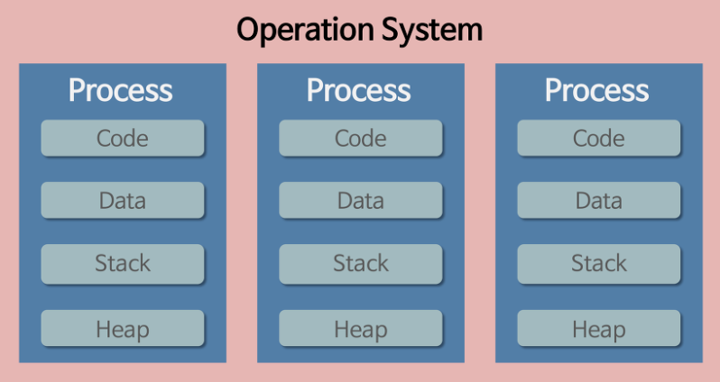
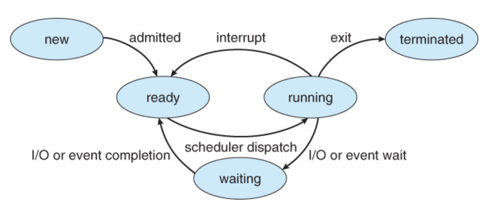

### What is Process ?

#### Process

- `Process` - 메모리 상에서 연속적으로 실행되고 있는 **프로그램의 Instance** 혹은 **Task** 

  > **Instance** ?
  >
  > - `프로그램` 이란 보조기억장치에 저장되어 있는 실행 코드
  > - `인스턴스` 란 프로그램을 실행해 OS 로부터 독립적으로 메모리 상에서 실행되는 단위

- **Process 의 특징**

  - `Process` 는 OS 로부터 **독립적인 메모리** 를 할당받음
  - `Process` 는 `프로그램` 의 실행단위이기 때문에 **1개 프로그램이 N 개 프로세스를 생성** 할 수 있음
  - `Process` 는 메모리 내에서 **병행 실행** 이 가능하며 독립적이기 때문에 데이터 공유 등을 위해선 **프로세스간 통신, 공유 메모리** 의 구현이 필요

- **Process 의 메모리 구조**

  - **Code** - 프로그램의 명령 주소로 기계어에 의해 제어되는 영역. Hex , Bin 파일 등이 해당됨
  - **Data** - 전역 변수, Static 변수, 배열, 구조체 등이 저장되는 영역. 프로그램이 실행될 때 생성, 종료될 때 반환됨
  - **Stack** - 프로그램의 임시 메모리 영역. 지역변수, Parameter, Return Value 등이 저장되며 함수 호출시 생성, 종료될 때 반환됨
  - **Heap** - 메모리를 동적으로 할당받는 동적 메모리 영역. 메모리 주소 값에 의해서만 참조되어 사용할 수 있기 때문에 모든 함수에서 참조 가능함

  > **BSS ( Block Stated Symbol )**
  >
  > - 컴파일을 진행하면서 `Data` 영역에 저장되어야 할 값들 중 초기화되지 않은 데이터들 까지 저장되면 메모리 부족 문제를 야기할 수 있다
  > - 이에 컴파일 시 초기화된 데이터는 `Data` 에, 초기화되지 않은 데이터는 `BSS` 에 저장해 해당 변수 혹은 객체가 존재한다는 것을 인지시킨다
  > - `BSS` 영역은 변수가 많아지더라도 값이 할당되어 있지 않기 때문에 `프로그램` 의 실행코드 크기를 증가시키지 않는다

 

- **Heap vs Stack**
  - `Heap` - 사용자에 의해 제어되는 공유 메모리 영역
    - <u>런타임</u> 시에 크기가 결정됨
    - **유연성** - 크기나 개수의 예측이 불가능한 개체 혹은 필요한 메모리 영역이 너무 큰 경우에 활용가능한 동적 메모리 공간
    - **속도 저하** - 메모리 할당, 해제, 힙 손상 등에 의해 프로그램의 실행 속도 저하가 발생함
    - **힙 경합** - 프로세스 내의 다수 스레드가 공유 데이터에 동시에 액세스하려는 경우 힙 경합이 발생하며 이에 따른 **컨텍스트 스위칭** , **스레드 락** 등 다양한 문제가 발생할 수 있음
  - `Stack` - 각 함수들의 LIfecycle 을 가진 스택 프레임이 저장되는 영역
    - <u>컴파일</u> 시에 크기가 결정됨
    - **효율성** - 함수의 Lifecycle 에 의해 스택 프레임이 생존하므로 메모리 낭비가 없으며 단일 명령으로 메모리 및 주소 관리가 가능함
    - **한계성** - 메모리 한계가 정해져있어 유연한 확장은 불가능함
- **Heap Overflow, Stack Overflow** 
  - **Heap** 영역과 **Stack** 영역은 각각 다른 방식으로 메모리를 적재한다
    - **Heap** - 첫 주소값을 기준으로 주소가 커지며 메모리를 적재
    - **Stack** - 마지막 주소값을 기준으로 주소가 작아지며 메모리를 적재
  - 각 영역의 메모리 버퍼가 지정값보다 커질 경우 **Buffer Overflow** 를 유발해 프로그램의 오류를 유발할 수 있다

#### PCB ( Process Control Block )

- `PCB` - 프로세스마다 존재하는 관리용 자료구조
- 프로세스 ID, 프로세스 상태, 프로그램 카운터, CPU 레지스터, CPU 스케줄링 정보, 주기억장치 관리 정보, 회계 정보, 입출력 상태 정보 등을 관리

#### Process State

- 프로세스의 Lifecycle 은 `new > [ ready - running - waiting ] > terminated` 로 이루어짐
  - `New` - 프로그램의 실행에 의한 프로세스 생성
  - `Ready` - 프로세스가 프로세서에 할당되기를 대기하는 상태
  - `Running` - **Ready Queue** 에 있던 프로세스가 프로세서를 할당받아 실행중인 상태
  - `Waiting` - 프로세스에 입출력이 필요하거나 다른 작업이 완료되기 까지 기다려야해서 잠시 중단된 상태
  - `Terminated` - 프로세스의 작업이 끝나 종료된 상태
- **Context Switching**
  - 프로세서가 다수의 프로세스를 효율적으로 처리하기 위해 빈번한 프로세스 전환을 통해 수행
  - **I/O**, **Interrupt** 등에 의해 발생할 수 있으며, 이 때 프로세서는 해당 시점까지 실행된 프로세스의 정보를 **PCB** 에 저장하고 다시 실행될 때 재개
  - `Context Switching` 의 비용은 순수히 <u>하드웨어의 성능</u> 과 <u>컨텍스트의 크기</u> 에 비례하며 오버헤드 발생시 성능 저하를 초래
  - 저장 및 복원하는 <u>컨텍스트의 크기</u> 를 줄이거나 횟수를 줄여 성능 저하를 극복

 

#### Process Scheduling

- 각 `프로세스` 들은 병행실행될 수 있으며 연산을 위해 CPU 를 사용하여야 함
- 이를 위해 프로세스간 우선 순위, 실행 순서 등을 고려해 **프로세스 스케쥴링** 을 진행

- **Scheduling Methods**
  - `Long-Term ( Job Scheduler )` - 어떤 프로세스가 입출력 / 계산 등 시스템 자원을 차지할 지 결정해 **Ready Queue** 로 보냄
  - `Short-Term ( CPU Scheduler )` - **Ready Queue** 내에서 **CPU** 에 할당해 실행할 프로세스를 결정함
  - `Mid-Term` - **Ready** 상태에서 **Running** 으로 넘어가지 못하거나 **Running** 상태에서 **Waiting** 으로 넘어온 프로세스들을 잠시 **Suspended** 하게 만들거나 ( Swap - Out ) 필요할 때 메모리로 다시 불러들여 ( Swap - In ) 메모리 효율성을 높임

#### IPC ( Inter-Process Communication )

- 서로 독립적인 메모리를 할당받는 `프로세스` 간에 데이터 통신이 가능하게 하는 방법
- `프로세스` 간의 협력이 필요할 겨우 **효과적인 IPC의 선정** 은 매우 중요함
- **주요 IPC 종류**
  - `Anonymous Pipe` - 자식 프로세스와 부모 프로세스간 읽기/쓰기가 가능한 단방향 파이프라인. 부모 프로세스가 데이터를 보내고 자식 프로세스가 이를 받아 특정 작업을 수행해야할 때 사용되며 **양방향 통신** 의 구현이 힘듦
  - `Named Pipe` - 서로 PPID ( 부모 프로세스 ) 가 다른 프로세스끼리 파일에 기반한 읽기/쓰기가 가능함. 송신프로세스는 이를 <u>쓰기전용</u> 으로 수신프로세스는 <u>읽기전용</u> 으로 여는 방식으로 통신을 수립기 때문에, **양방향 통신**을 구현하려면 두 개의 파일이 필요함
  - `Mesage Queue` - 마치 **컨베이어 벨트** 처럼 커널의 메모리 공간에 데이터를 올리고 여러 프로세스가 접근해 데이터를 꺼내와 사용할 수 있게 함
  - `Shared Memory` - 커널에 요청해 프로세스 간에 **공유되는 메모리** 를 할당받을 수 있음. IPC 중개자 없이 바로 메모리에 접근할 수 있어 속도가 빠르나 공유 자원을 올바르게 관리하는 것이 중요함
  - `Socket` - 서로 다른 시스템에 있는 프로세스 간에 **네트워크 통신** 을 가능하게 함. 지정된 도메인 및 이름 등을 통해 각 프로세스가 식별하고 연결을 수립해 메세지를 전송할 수 있음
  - `Semaphore` - 프로세스 간에 **데이터를 동기화하고 보호** 함. 공유된 자원에 동시에 여러 프로세스가 접근하지 못하게 하는 역할

### REFERENCE

- https://ko.wikipedia.org/wiki/%ED%94%84%EB%A1%9C%EC%84%B8%EC%8A%A4_%EA%B0%84_%ED%86%B5%EC%8B%A0
- https://ko.wikipedia.org/wiki/%ED%94%84%EB%A1%9C%EC%84%B8%EC%8A%A4
- https://juyoung-1008.tistory.com/47
- https://operatingsystems.tistory.com/entry/OS-%EC%8A%A4%EC%BC%80%EC%A5%B4%EB%9F%AC-scheduler