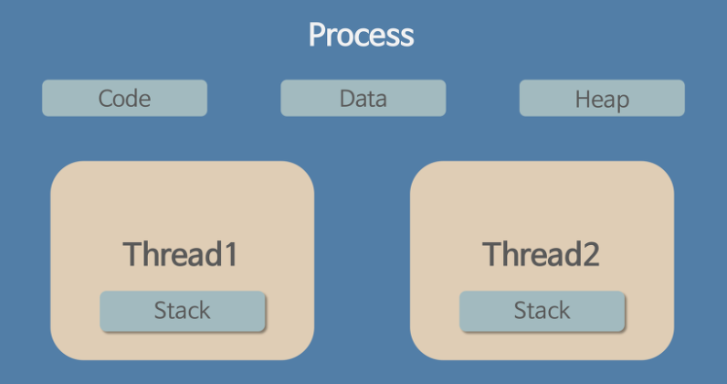

### What is Thread ?

#### Thread

- `Thread` - 프로세스 내에서 독립적인 제어흐름을 갖는 실행단위

- **Thread 의 특징**

  - `Thread` 는 프로세스의 **메모리 및 자원을 공유**

  - `Thread` 는 `프로세스` 의 실행단위이기 때문에 **1개 프로세스 내에 N개의 스레드를 생성** 할 수 있음

  - `Thread` 는 한 프로그램 내에서 여러가지 작업을 동시에 수행할 수 있게 함 

    > **네트워킹** 과 같이 애플리케이션의 메인 비즈니스 플로우에 부가적으로 다른 태스크를 동시에 수행해야할 때 멀티 스레드 환경을 이용함 

  - `Thread` 는 프로세스와 달리 서로 **공유 메모리가 존재** 하므로 커널 레벨의 지원이 없이도 스레드 간 통신이 가능함

- **Thread 의 메모리 구조**

  - 하나의 프로세스 안에서 각 `Thread` 는 별도의 레지스터와 스택을 할당받으며 `Heap` , `Data` , `Code` 등은 공유영역으로 사용
  - 각 `Thread` 는 독립적인 작업을 수행하기 위해 별도의 **PC Register, Stack** 을 가짐
  - **PC Register** 를 통해 각 쓰레드는 CPU를 할당받을 수 있다. 다수의 스레드가 개별 작업을 동시에 진행하는 것 또한 CPU를 번갈아가며 선점하기 때문이므로 현재 스레드의 명령어가 어디까지 실행되었는지를 기억해야 함
  - **Stack** 은 지역변수, Parameter, Return Value 등이 저장되며 함수 호출시 생성, 종료될 때 반환되는 메모리 공간이다. 그렇기 때문에 `Thread` 간에 독립적인 함수 호출 및 실행이 가능하게 하며 이는 **독립적인 작업흐름**을 갖기 위한 최소 조건이 됨
  - 프로세스는 각 `Thread` 가 수행하는 작업을 종합해 하나의 전체 흐름을 가져야하므로 **공유영역** 을 이용함

 

#### TCB ( Thread Control Block )

- `TCB` - 스레드마다 존재하는 관리용 자료구조
- 각 스레드의 상태 및 입출력 정보 등을 관리하는데, 하나의 **프로세스** 가 여러개의 **스레드** 를 가지므로 `PCB` 에는 실행중인 `TCB` 들의 주소정보를 관리

#### Thread Critical Section Synchronization

- **임계영역 ( Critical Section )** - 둘 이상의 스레드가 동시에 접근했을 시 오류를 유발할 수 있는 공유 자원 또는 코드

- **Semaphore**

  - **스레드** 가 공유 자원을 사용하는 동안 **세마포어** 값을 변경해 다른 스레드들을 기다리게 함으로서 동기화를 지원함
  - **세마포어** 는 임계영역의 공유자원에 대해 현재 접근 가능한 스레드의 개수를 나타내는 변수로서 아래 두 함수를 이용해 스레드를 대기 / 활성화 상태로 만듬
  - `wait()` - 현재 **세마포어** 의 값이 0 일 경우, 스레드를 대기시킴
  - `signal()` - **세마포어** 의 값에 의해 사용가능한 상태일 경우, 대기시킨 스레드의 우선순위에 따라 스레드를 활성화시킴
  - **세마포어** 는 소유가 아닌 모두가 통제함 ( 개별 스레드가 설정 , 해제할 수 있음  )

- **Mutex ( Mutual Exclusion )**

  - **뮤텍스** 값을 이용해 **같은 프로세스 내의 임계영역** 에의 진입을 통제하는 것으로, 같은 임계영역에 접근하는 여러 스레드가 동시에 실행되는 것을 방지함으로서 공유 자원의 동기화를 지원함

    > **뮤텍스** - 0, 1 로 이루어져 상태를 나타내는 binary Semaphore

  - **임계영역** 의 자원을 이용하고 있는 스레드가 **뮤텍스** 를 설정해 다른 스레드가 해당 자원에 접근하면 안됨을 명시함

  - **뮤텍스** 는 소유한 스레드에 의해 통제됨 ( 소유 스레드만이 설정, 해제할 수 있음 )

### REFERENCE

- https://ko.wikipedia.org/wiki/%EC%8A%A4%EB%A0%88%EB%93%9C_(%EC%BB%B4%ED%93%A8%ED%8C%85)

- https://en.wikipedia.org/wiki/Thread_control_block
- https://ko.wikipedia.org/wiki/%EC%84%B8%EB%A7%88%ED%8F%AC%EC%96%B4