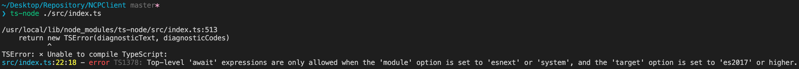

l

### TypeScript ) Top-Level 'await' ... error 다루기

>✔ **IDE : Visual Studio Code v 1.55.0**
>
>✔ **OS :  macOS Big Sur 11.3 Beta**
>
>✔ **Lang: Typescript**

#### Problem

- 편의성을 위해 `Typescript` 를 이용한 **NCP API Wrapper 모듈** 을 만들고 테스트를 진행
- 해당 모듈의 메소드는 외부 API 통신이 주 목적이므로 `async` 함수로 구현됨
- `jest` 를 이용한 테스트들은 NCP API 의 **Mock 환경** 을 조성해 진행함
- 배포 직전에 외부 API 이용 환경과 일치시키고 **실제 환경** 에 대해 적용 테스트를 진행 중에 아래와 같은 오류 발생

#### Solution

- 위 문제는 **ECMA** 가 지원하는 `Top-Level await` 를 이용해 모듈의 Top-Level 에서 `async` 없이도 사용할 수 있는 범위 안에 속해있지 않다는 것을 의미함

- `Top-Level await` 는 아직 타겟 컴파일러가 `es2017` 이상, `esnext 또는 system` 모듈 상에서만 가능함

  > **From `Top-Level await` Github -** https://github.com/tc39/proposal-top-level-await

- 추후 추가될 수 있으나 현재는 일반 모듈에는 지원되지 않으므로 필요 시 모듈의 Top-Level 에서 `await` 을 사용하기 위해선 래핑해 사용할 것

~~~typescript
const asyncSendSMS = async () => {
  const response = await client.sendSMS( parameter )
  // write something after async function
}
// run async function
asyncSendSMS()
~~~

### REFERENCE

- https://github.com/tc39/proposal-top-level-await