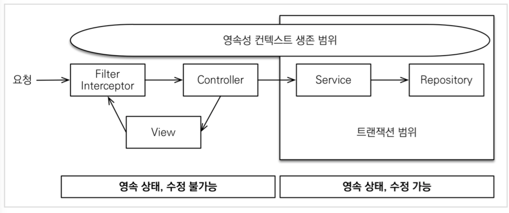
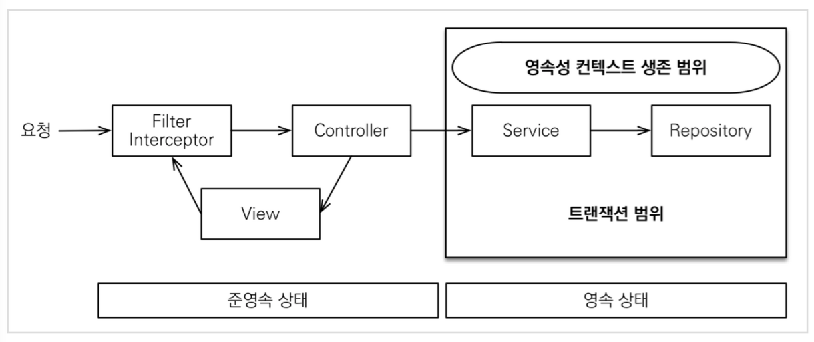

### JPA Open-In-View 

> ✔ **Module : Spring Data JPA**

#### Open-In-View ?

- Open-Session-In-View 라고도 함
- 영속성 컨텍스트의 생존 범위를 정의

#### 1. OSI : True ( default )

- 트랜잭션 Scope 를 넘어서 Jpa Service 바깥까지 영속성 컨텍스트가 유지되어 사용가능
- 컨트롤러 등 트랜잭션이 종료되도 외부에서 영속성 컨텍스트 활용 가능
- **BUT** DB Connection 이 계속해서 유지되어있어야함, 이를 고려해 설정할 것 

 

#### 2. OSI : False

- 트랜잭션 Scope 내에서만 영속성 컨텍스트가 유지됨
- 트랜잭션이 종료되면 영속성 컨텍스트 또한 닫히므로 활용 불가
- Batch 와 같은 DB 의 성능이 중요한 애플리케이션에 적합

