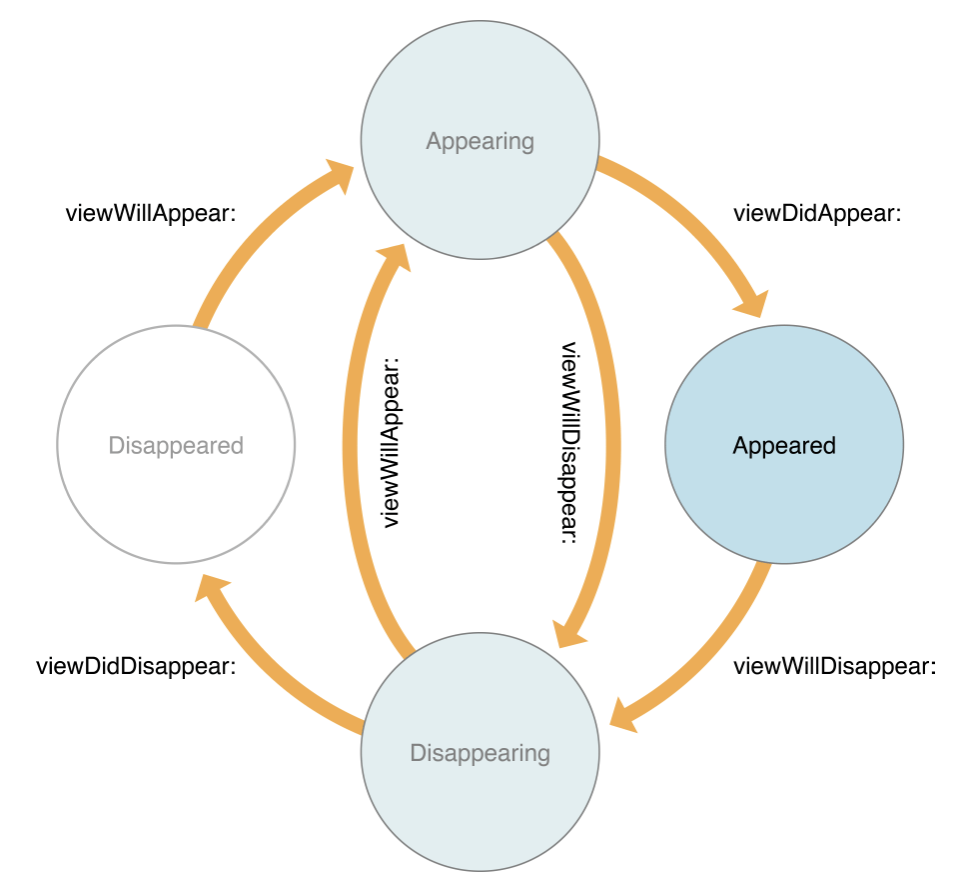
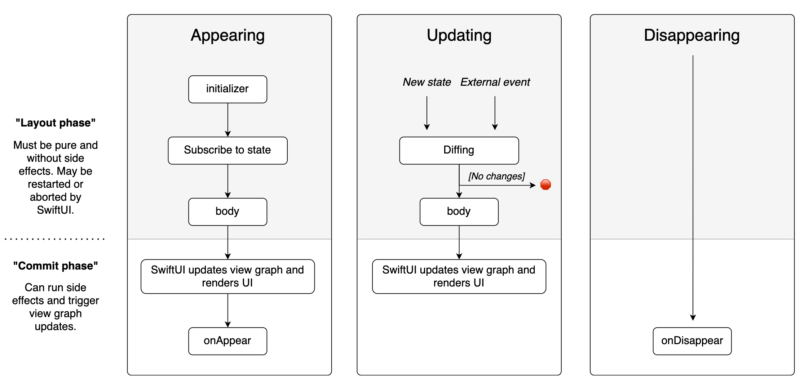

### SwiftUI Lifecycle

>✔ **Xcode : Version 12.4 (12D4e)**
>
>✔ **OS :  macOS Big Sur 11.1**

#### Background

- 프로젝트 진행을 위해 급하게 **SwiftUI** 를 익혔고 정확한 작동원리의 숙지보다는 구현에 치중함
- **SwiftUI** 에서 애플은 기존의 Swift / Objective-C 의 방식과는 전혀 다른 새로운 패러다임을 제시했음
- 필수적으로 알아야할 **Lifecycle** 을 우선 알아보자

#### SwiftUI View Lifecycle ( vs Origin )

- **기존 UIViewController 의 라이프사이클**

 

> 기존 UIViewController 는 위와 같은 State Relation 을 통해 작동한다. 총 **4가지의 State 와 State-Transition Event** 들을 통해 뷰를 제어하고, 사용자의 입력을 받으며 이에 맞는 작업을 처리한다. 복잡해보이지만 View 의 <u>State 를 구체적이며 명시적</u>으로 나누었고 Transition Event 에 의해 통제되는 전형적인 UI 라이프 사이클이다.

- **SwiftUI 의 라이프사이클**

 

1. **Layout / Commit Phase** ( 렌더링 )

   > **Layout Phase**
   >
   > - 기본적인 뷰 레이아웃의 생성, 뷰에 연결된 State 값의 추적, State 변화 감지 등 실제 화면에 렌더링 되기 전 작업을 수행한다.
   >
   > - 각 뷰 레이아웃은 **struct** 로 정의하며 **body ( type : some View )** 변수에 레이아웃을 기술한다.
   >
   > - 뷰 레이아웃은 '뷰 레이아웃' 그 자체여야 한다. 즉, **직접적인 값의 변화** 등을 기술하지 않는다 ( 값의 변화가 필요하다면 *State* 를 이용 )
   >
   > - ~~~ swift
   >   // view Layout : body
   >   var body: some View {
   >     ...
   >     cnt = array.size + 1 // Err ! 값의 변화는 레이아웃 내에서 기술하지 않아야 한다.
   >     ...
   >   }
   >   ~~~
   >
   > **Commit Phase**
   >
   > - 뷰에 사용되는 **값의 변화**, 각 행위에 따른 **뷰 컴포넌트 들의 변화** 등을 감지하고 렌더링을 수행한다.
   > - 해당 시점에서 사용되지 않는 뷰들을 제거하고, 뷰와 관련된 변화들을 실질적으로 화면에 렌더링한다.

2. **Appearing / Updating / Disappearing Phase** ( 이벤트 )

   > **Appearing Phase**
   >
   > - 뷰를 생성해 뷰 그래프에 포함시키는 과정
   >
   > - **Init** - 처음부터 *state* 를 연결하여 한번에 만드는 것이 아닌 뷰 계층을 미리 구축해 효율성을 추구했다.
   > - **state Connect** - 뷰를 state 와 연결한 후 **body** ( 뷰 레이아웃 ) 를 호출한다.
   > - **update and Appear** - 뷰의 변화를 반영하고, UI 를 렌더링한 후 **onAppear()** 메소드를 호출한다. 
   >   - **[ 중요 ]** onAppear() 메소드는 Top-down 방식 [ Parent → Child ] 으로 순차 호출됨 
   >
   > **Updating Phase**
   >
   > - 동작이나 상태 변화를 뷰에 반영하는 과정
   > - **Receive** - 사용자의 동작을 입력받고 상태 변화 등을 **View.onReceive()** 메소드를 통해 감지한다.
   > - **Equate** - 외부 동작이나 상태 변화를 가진 뷰를 기존의 스냅샷과 비교한다. 우리는 이 때, 뷰에 **Equatable** 프로토콜을 적용시키고 **EquatbleView** 로 래핑함으로서 뷰의 사용자 정의를 가능하게 할 수 있다.
   > - **Invalidate and Update** - SwiftUI 가 뷰의 유효성을 검증하고 뷰 그래프에 업데이트하여 검증된 뷰들을 포함시킨다. 
   >   - **[ 중요 ]** update 는 뷰 계층에 따라 Top-Down 으로 진행되며 이를 통해 검증과 상태 변화에 따른 리렌더링의 수를 줄였다.
   >   - **[ 중요 ]** *state 에 연결된 뷰* 만 검증에 대한 구현이 가능하며, 그 외의 뷰는 전부 **리렌더링** 된다.
   >
   > **Disappearing Phase**
   >
   > - 뷰 계층에서 뷰를 삭제하는 과정
   > - **Disappear** - 뷰 계층에서 해당 뷰를 삭제한 후 **onDisappear()** 메소드가 호출된다. 뷰가 먼저 계층에서 제외되고 **onDisappear()** 메소드가 호출되는 것에 주의하자.

   

### REFERENCE

- https://developer.apple.com/library/archive/referencelibrary/GettingStarted/DevelopiOSAppsSwift/WorkWithViewControllers.html
- https://www.vadimbulavin.com/swiftui-view-lifecycle/