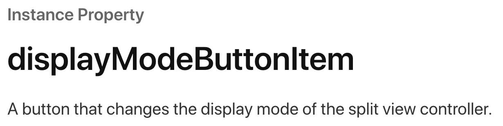

### SwiftUI Stack with Navigation View Cautions

>✔ **Xcode : Version 12.4 (12D4e)**
>
>✔ **OS :  macOS Big Sur 11.1**

#### Background

- **SwiftUI** 의 *Navigation View* 를 이용해 다단 Navigation Link 를 구현할 시 에러 발생

- *Navigation Destination* 이 되는 뷰들은 아래와 같이 Custom 한 **Presentation Closing** 을 이행함

- ~~~swift
  @Environment(\.presentationMode) var presentation
  ...
  Button(action: { presentation.wrappedValue.dismiss() }) {
  	/// View about Linking Button Implementation
  }
  ~~~

- **Main View** 에서 기본 Navigation View 와 2단 이상의 Navigation Link 를 통해 **Navigation Stack** 이 만들어질 경우 아래와 같은 에러 발생

- **[ Issue ]** 동일 조건에서 실행시 iPad 에서는 발생하지 않고 iPhone 에서는 발생

- ~~~swift
  [Assert] displayModeButtonItem is internally managed and not exposed for DoubleColumn style. Returning an empty, disconnected UIBarButtonItem to fulfill the non-null contract.
  ~~~

#### Approach

- 에러에서 제시된 **displayModeButtonItem** 의 정의는 아래와 같음 
- **Reference )** https://developer.apple.com/documentation/uikit/uisplitviewcontroller/1623196-displaymodebuttonitem 

 

- 기본적인 **Navigation View** 에서 iPad 의 경우 *split view controller* 를 기반으로 하기 때문에 **navigationBarHidden** 값을 줘도 *displayModeButtonItem* 이 생기며, iPhone 에는 1단 Navigation Link 에는 없으나 Navigation Link 의 스택이 2가 넘어가면 위와 같은 에러가 발생하는 것을 확인

  ~~~swift
  .navigationBarHidden(true)
  ~~~

#### Solution

- **NavigationView** 에 명시적인 StackNavigationViewStyle 를 부여해 해당 에러를 해결

~~~swift
/// 1. MainView()
...
NavigationView {
  /// Implementation
  NavigationLink(destination: FirstView().navigationBarHidden(true)){
    /// View about Linking Button Implementation
  }
}
.navigationViewStyle(StackNavigationViewStyle())
...
/// 2. FirstView()
...
	NavigationLink(destination: SecondView().navigationBarHidden(true)) {
    /// View about Linking Button Implementation
  }
...
/// 3. SecondView()
...
~~~

